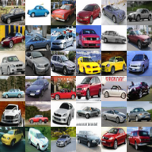
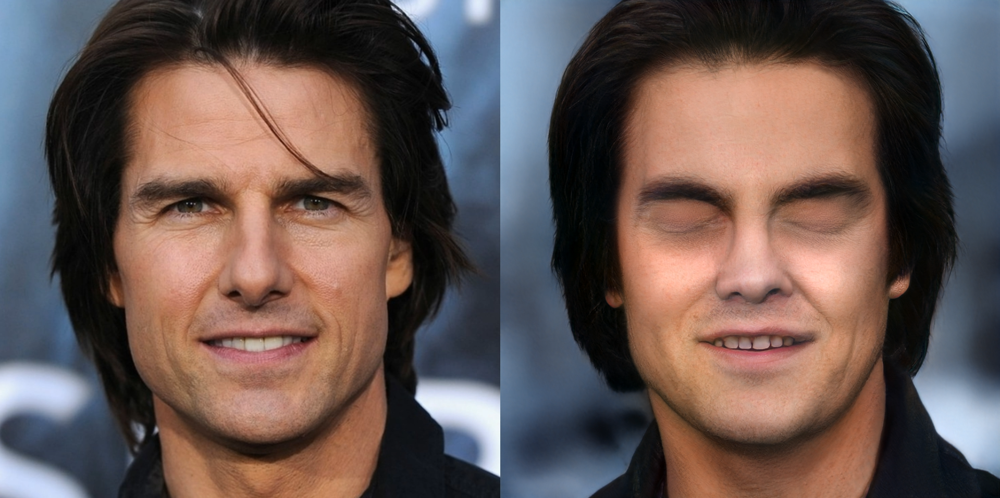
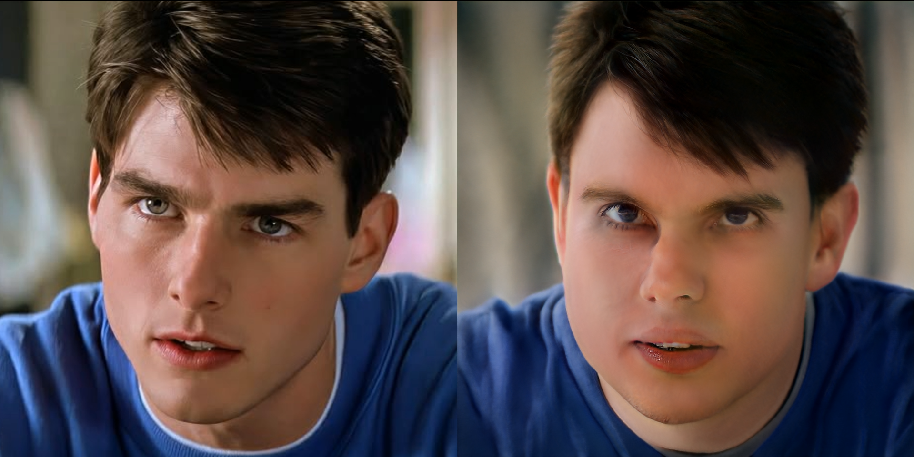

# StyleGAN2-Ada-Pytorch-Image-Generation
Generated great images using StyleGAN2-Ada,  interpolation, truncation and projections.

# Generation Results

## Curated MetFaces Images without truncation

## Un-curated MetFaces Images with truncation

## Style-Mixing on Metfaces

## Class conditional CIFAR-10 images

# Projection Results

